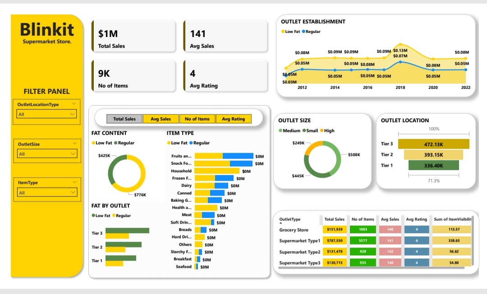

# Blinkit Supermart Store Analysis: Optimizing Sales, Satisfaction, and Inventory

## 📊 Project Overview
Comprehensive analysis of Blinkit's sales performance, customer satisfaction, and inventory distribution to identify optimization opportunities across:
- Revenue improvement
- Customer experience enhancement 
- Inventory management streamlining

## 🎯 Key Performance Indicators (KPIs)
| KPI | Description |
|------|------------|
| **Total Sales** | Overall revenue ($1M) |
| **Average Sales** | Revenue per transaction ($141) |
| **Number of Items** | Inventory breadth (9K items) |
| **Average Rating** | Customer satisfaction (4/5) |

## 🔍 Key Insights & Visualizations

### 1. Sales by Fat Content
![Fat Content Donut Chart]
- **Regular Fat**: $776K (68% of sales)
- **Low Fat**: $425K (32% of sales)

### 2. Sales by Item Type
![Item Type Bar Chart]
- Top Performers: Fruits/Veg, Snack Foods
- Secondary: Household, Frozen Foods

### 3. Outlet Performance
- Tier 3 → $472K
- Tier 2 → $393K 
- Tier 1 → $336K

### 4. Outlet Type Comparison
| Type | Total Sales | Items | Avg Sales | Rating |
|------|------------|-------|----------|--------|
| Supermarket Type1 | $787K | 5,577 | $141 | 4 |
| Grocery Store | $151K | 1,003 | $140 | 4 |
| Supermarket Type2 | $131K | 928 | $142 | 4 |

## 💡 Recommendations
1. **Strategic Expansion**  
   Focus on Supermarket Type1 outlets in Tier 3 locations

2. **Inventory Optimization**  
   Capitalize on Regular fat items' popularity while analyzing Low Fat niches

3. **Outlet Sizing**  
   Prioritize Small/Medium outlets over High-size (underperforming by 50%)

4. **Marketing Focus**  
   Highlight top categories (Fruits/Veg, Snack Foods) in campaigns

## 🛠️ Technologies Used
- **Python** (Pandas, Matplotlib)
- **Power BI** (Visualizations)
- **SQL** (Data querying)
- **Excel** (Initial data cleaning)

